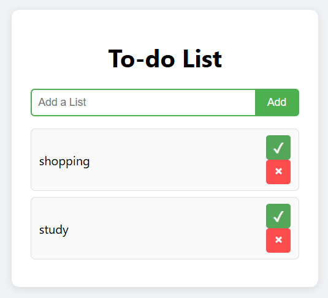

# 📝 Todo List

A simple and clean todo list web application built with vanilla JavaScript, HTML, and CSS.

## ✨ Features

- ✅ Add new tasks
- ✅ Mark tasks as completed with strikethrough effect
- ✅ Delete tasks permanently
- ✅ Data persistence using localStorage
- ✅ Responsive and user-friendly design
- ✅ Keyboard support (Enter key to add tasks)

## 🚀 Demo

[Live Demo](https://arianfarzin.github.io/todo-list/) *(if you deploy it)*

## 📸 Screenshot

 *(optional - add a screenshot)*

## 🛠️ Technologies Used

- HTML5 - Structure
- CSS3 - Styling and layout
- JavaScript (ES6) - Functionality and logic
- localStorage API - Data persistence

## 📦 Installation

1. Clone the repository:
`bash
git clone https://github.com/ArianFarzin/todo-list.git
Navigate to the project directory:
cd todo-list
Open index.html in your browser:
# On Windows
start index.html

# On Mac
open index.html

# On Linux
xdg-open index.html
💡 Usage
Type your task in the input field
Click the Add button or press Enter to add the task
Click on the task text or the ✓ button to mark it as completed
Click the × button to delete the task permanently
📂 Project Structure
todo-list/
│
├── index.html      # Main HTML file
├── style.css       # Styles and layout
├── script.js       # JavaScript functionality
└── README.md       # Project documentation
🎯 Future Improvements
[ ] Add task categories/tags
[ ] Add due dates for tasks
[ ] Filter tasks (All, Active, Completed)
[ ] Edit existing tasks
[ ] Dark mode toggle
[ ] Export/Import tasks
👨‍💻 Developer
Arian Farzin
